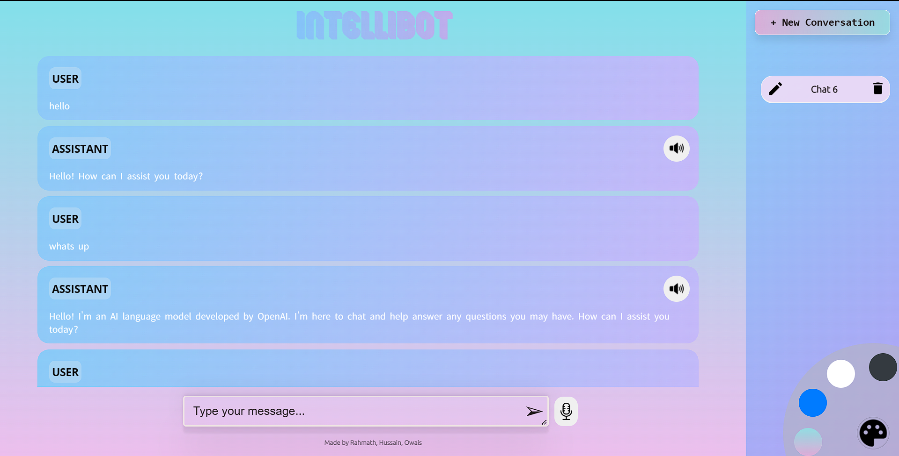
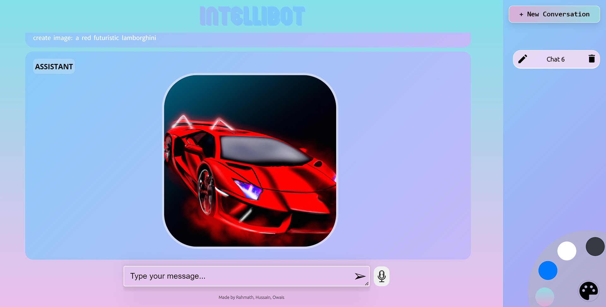

# INTELLIBOT

## Introduction

This project combines the power of OpenAI's GPT-3.5 Turbo and DALL·E models to enable chat-based conversations and image generation. It also incorporates additional features such as voice listening, speech synthesis, themes, and an interactive user interface. This README file provides instructions on setting up and running the project.

## Purpose

The purpose of this project is to showcase the capabilities of OpenAI's language and image models and provide an interactive and seamless experience for users. By leveraging the OpenAI API, users can have conversations with the chatbot, generate images based on prompts, and interact with a user-friendly interface. The additional features of voice listening, speech synthesis, and themes enhance the overall user experience.

## Run Method

To run the project locally, follow these steps:

1. **Download Node.js**: Download and install Node.js from the official website: [https://nodejs.org](https://nodejs.org).

2. **Install Visual Studio Code**: Download and install Visual Studio Code (VS Code) from the official website: [https://code.visualstudio.com](https://code.visualstudio.com).

3. **Download Project Folder**: Download the project folder from the repository and extract it to a location of your choice.

4. **Open the Project in VS Code**: Open Visual Studio Code and navigate to the project folder by selecting "File" -> "Open Folder" in the menu or using the shortcut `Ctrl + K Ctrl + O`. Select the project folder that you extracted in the previous step.

5. **Install Dependencies**: Open a terminal in VS Code by selecting "View" -> "Terminal" in the menu or using the shortcut `Ctrl + ` `. Run the following command to install the project dependencies:

            npm install

6. **Configure API Key**: Create a file named `.env` in the project folder and add the following line to it, replacing `"Paste your open ai apikey"` with your actual OpenAI API key:

            API_KEY="Paste your open ai apikey"

7. **Install Additional Packages**: Run the following command in the terminal to install additional packages required by the project:

            npm install cors dotenv express morgan node-fetch nodemon openai react react-dom react-modal react-scripts web-vitals

8. **Run Frontend and Backend**: Open two separate terminals in VS Code. In one terminal, run the following command to start the frontend:

            npm run start:frontend

In the other terminal, run the following command to start the backend:

               npm run start:backend

This will start the frontend and backend servers.

9. **Access the Project**: Once the servers are running, you can access the project by opening a web browser and navigating to `http://localhost:3000`.

10. **Explore the Project**: You are now ready to interact with the chatbot, generate images, and explore the additional features of voice listening, speech synthesis, and themes. Follow the on-screen instructions to navigate the interface and enjoy the project.

## Output GIF and Photos

- .gif)
- 

- 

The project generates various outputs, including GIFs and photos. The amount of space required for these outputs may vary depending on the specific usage. Ensure that you have sufficient disk space to accommodate the generated files. It is recommended to monitor the space usage periodically and clean up unnecessary outputs to free up disk space if needed.

Please note that the size of the outputs can be influenced by factors such as the complexity of the generated content, the duration of conversations, and the number of image generation requests made.
